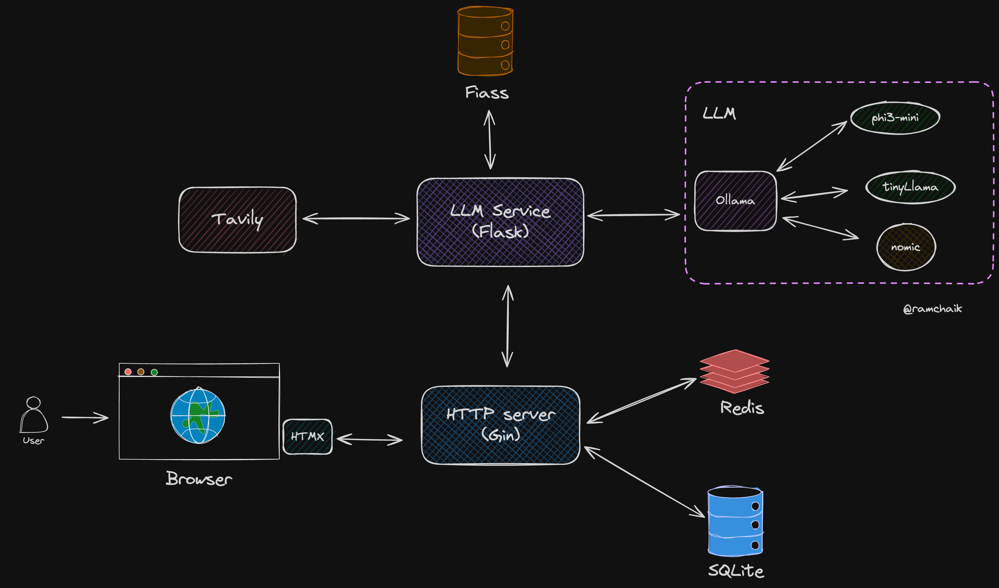

# Nous: Your Personal Knowledge Assistant 🧠💬

Nous is an open-source personal knowledge assistant that allows you to interact with your personal documents and text files using natural language. It's designed with a focus on privacy, security, and local processing. 

## Demo 🎥

Note: For the demo, I personalized Nous using the Lord of the Rings Trilogy PDF.


## 🌟 Key Features

- **Talk to Your Documents**: Interact with your personal knowledge base through natural language queries.
- **Local Processing**: Uses local LLMs for enhanced privacy and security.
- **Self-Corrective RAG**: Implements a Corrective RAG (CRAG) system for accurate information retrieval and response generation.
- **Web Search Integration**: Falls back to web search when local knowledge is insufficient.
- **Document Ingestion**: Supports various document sources including Google Docs, Google Drive, Dropbox, and GitHub gists.

## 🏗️ Architecture



Nous consists of two main services:

1. **LLM Service** (Flask App):
   - Manages communication with local LLMs via Ollama
   - Implements the Corrective RAG (CRAG) system
   - Uses LangGraph and Langchain for agentic workflow
   - Utilizes FAISS as the vector database
   - Employs Phi3-mini and TinyLlama as local LLMs
   - Uses the nomic model for embeddings
   - Integrates Tavily for web search capabilities

2. **HTTP Web Server** (Golang with Gin):
   - Renders the UI using HTMX
   - Stores chat sessions and messages in SQLite
   - Utilizes Redis for query caching
   - Implements Levenshtein distance for efficient string matching on recent queries

##  🧠 CRAG Architecture


## 📁 Project Structure

```
.
├── app/                  # Golang HTTP server
│   ├── cmd/
│   ├── db/
│   ├── internal/
│   ├── static/
│   └── templates/
└── llm_api/              # Flask LLM service
    ├── data/
    ├── llm_env/
    ├── app.py
    ├── config.py
    └── ...
```

## 🛠️ Tech Stack
- **Local LLMs**: Phi3-mini, TinyLlama
- **Vector Database**: FAISS
- **Embedding Model**: Nomic
- **Web Search**: Tavily
- **Web Server**: Golang with Gin
- **Frontend Rendering**: HTMX
- **Cache**: Redis
- **Database**: SQLite
- **Workflow**: LangGraph, Langchain
- **Communication with LLMs**: Ollama

## 🚀 Getting Started

### Prerequisites

- [Ollama](https://ollama.com/)
- Python 3.12+
- Go 1.22+
- Redis

### Setup

1. **Set up Ollama:**
   ```
   ollama pull phi3:mini tinyllama nomic-embed-text
   ollama serve
   ```

2. **Start Redis server:**

    Using Docker
   ```
   docker run --name redis -p 6379:6379 -d redis
   ```

    Else if you're not running a container
   ```
   redis-server
   ```
   

3. **Set up LLM service:**
   ```
   cd llm_api
   python -m venv llm_env
   source llm_env/bin/activate
   pip install -r requirements.txt
   python app.py
   ```

4. **Set up Golang app:**
   ```
   cd app
   make run
   ```

## 🛠️ Usage

To add your personal links for Nous to process:

1. Open the `/llm_api/config.py` file.
2. Locate the `URLS` list in the file.
3. Add your personal URLs to this list.
4. Save the file and restart the Flask app for changes to take effect.

Example:

```python
URLS = [
    "https://tip.golang.org/tour/concurrency.article",
    "https://tip.golang.org/doc/effective_go",
    "https://your-personal-link.com/document.pdf",
    "https://another-personal-link.com/notes.txt"
]
```

After adding your links, restart the Flask app to ingest the new documents into the vector database.


## 🔮 Future Enhancements

1. Add support for uploading links directly from the UI for ingestion into the vector store
2. Implement source attribution in the chat UI for web sources to improve transparency
3. Expand support to include more document formats such as Excel, Markdown, and LaTeX.
4. Integrate additional LLMs for improved response diversity and quality.
5. Introduce customizable workflows for specific use cases, such as study aids or meeting summaries.

## 💡 Why Nous?

Nous was created to provide a seamless and secure way to interact with personal notes and documents. It prioritizes local processing and privacy while offering powerful knowledge retrieval and interaction capabilities.

## Contributing 🤝

Contributions are welcome! Please feel free to submit a Pull Request.

## License 📄

This project is licensed under the [MIT License](LICENSE).
