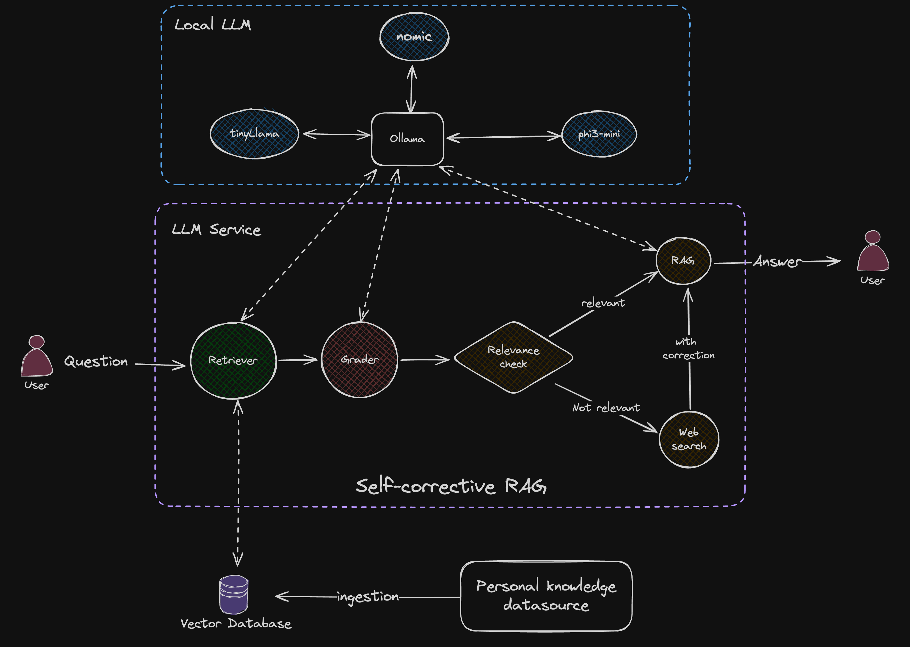

# Nous: Your Personal Knowledge Assistant 🧠💬

Nous is an open-source personal knowledge assistant that allows you to interact with your personal documents and text files using natural language. It's designed with a focus on privacy, security, and local processing.

## Demo 🎥

Note: For the demo, I personalized Nous using the Lord of the Rings Trilogy PDF.


## 🌟 Key Features

- **Talk to Your Documents**: Interact with your personal knowledge base through natural language queries.
- **Local Processing**: Uses local LLMs for enhanced privacy and security.
- **Self-Corrective RAG**: Implements a Corrective RAG (CRAG) system for accurate information retrieval and response generation.
- **Web Search Integration**: Falls back to web search when local knowledge is insufficient.
- **Document Ingestion**: Supports various document sources including Google Docs, Google Drive, Dropbox, and GitHub gists.

## 🏗️ Architecture


Nous consists of two main services:

1. **LLM Service** (Flask App):
   - Manages communication with local LLMs via Ollama
   - Implements the Corrective RAG (CRAG) system
   - Uses LangGraph and Langchain for agentic workflow
   - Utilizes FAISS as the vector database
   - Employs Phi3-mini and TinyLlama as local LLMs
   - Uses the nomic model for embeddings
   - Integrates Tavily for web search capabilities

2. **HTTP Web Server** (Golang with Gin):
   - Renders the UI using HTMX
   - Stores chat sessions and messages in SQLite
   - Utilizes Redis for query caching
   - Implements Levenshtein distance for efficient string matching on recent queries

##  🧠 CRAG Workflow


## 📁 Project Structure

```
.
├── Dockerfile.ollama
├── LICENSE
├── ReadMe.md
├── app                       # Golang HTTP server
│   ├── Dockerfile
│   ├── Makefile
│   ├── cmd
│   ├── db
│   ├── go.mod
│   ├── go.sum
│   ├── internal
│   ├── nous.db
│   ├── static
├── docker-compose.yml
├── docs
│   ├── crag-architecture.png
│   ├── nous-architecture.png
│   └── nous-demo.gif
├── llm_api                   # Flask app; LLM service
│   ├── Dockerfile
│   ├── __pycache__
│   ├── app.py
│   ├── config.py
│   ├── data
│   ├── document_processor.py
│   ├── embeddings.py
│   ├── graph.py
│   ├── llm.py
│   ├── llm_env
│   ├── main.py
│   ├── prompts.py
│   ├── requirements.txt
│   └── retriever.py
└── start-ollama.sh
```

## 🛠️ Tech Stack
- **Local LLMs**: Phi3-mini, TinyLlama
- **Vector Database**: FAISS
- **Embedding Model**: Nomic
- **Web Search**: Tavily
- **Web Server**: Golang with Gin
- **Frontend Rendering**: HTMX
- **Cache**: Redis
- **Database**: SQLite
- **Workflow**: LangGraph, Langchain
- **Communication with LLMs**: Ollama

## 🚀 Getting Started

### Prerequisites

- Docker and Docker Compose
- [Ollama](https://ollama.com/) (for local development only)

### Setup with Docker Compose

1. Clone the repository:
   ```
   git clone https://github.com/ramchaik/nous.git
   cd nous
   ```

2. Create a `.env` file in the **llm_api** directory with the following content:
   ```
   TAVILY_API_KEY=your_tavily_api_key_here
   ```

3. Run the entire setup with Docker Compose:
   ```
   docker-compose up --build
   ```

   This command will:
   - Build and start the Ollama service
   - Start a Redis container
   - Build and start the LLM service (Flask app)
   - Build and start the Golang app

4. Access the Nous web interface at `http://localhost:8080`

### Local Development Setup

If you prefer to run the services locally for development:

1. **Set up Ollama:**
   ```
   ollama pull phi3:mini tinyllama nomic-embed-text
   ollama serve
   ```

2. **Start Redis server:**
   ```
   docker run --name redis -p 6379:6379 -d redis
   ```

3. **Set up LLM service:**
   ```
   cd llm_api
   python -m venv llm_env
   source llm_env/bin/activate
   pip install -r requirements.txt
   python app.py
   ```

4. **Set up Golang app:**
   ```
   cd app
   make run
   ```

## 🛠️ Usage

To add your personal links for Nous to process:

1. Open the `llm_api/config.py` file.
2. Locate the `KNOWLEDGE_BASE_URLS` list in the file.
3. Add your personal URLs to this list.
4. Save the file and restart the Flask app for changes to take effect.

Example:

```python
KNOWLEDGE_BASE_URLS = [
    "https://your-personal-link.com/document.pdf",
    "https://another-personal-link.com/notes.txt"
]
```

After adding your links, restart the Flask app to ingest the new documents into the vector database.

## 🔧 Configuration

Nous uses two main configuration files: one for the Golang HTTP server and another for the Python Flask LLM service.

### Golang HTTP Server Configuration

Located at: `app/internal/config/config.go`

The Golang server configuration manages various aspects of the web server, including paths, addresses, and connections.

#### Configuration Structure

```go
type Config struct {
    StaticPath    string
    ServerAddr    string
    DatabasePath  string
    LLMBaseURL    string
    RedisAddr     string
}
```

#### Configuration Options

- `StaticPath`: Path to static files (default: `"../static"` relative to the executable)
- `ServerAddr`: Address and port for the HTTP server (default: `:8080`)
- `DatabasePath`: Path to the SQLite database file (default: `"./nous.db"`)
- `LLMBaseURL`: URL of the LLM service (default: `"http://localhost:5000"`)
- `RedisAddr`: Address of the Redis server (default: `"localhost:6379"`)

#### Customizing the Configuration

You can customize these settings using environment variables:

1. `STATIC_PATH`: Set the path to static files
2. `SERVER_ADDR`: Set the server address and port
3. `DATABASE_PATH`: Set the path to the SQLite database file
4. `LLM_BASE_URL`: Set the URL of the LLM service
5. `REDIS_ADDR`: Set the address of the Redis server

Example:
```bash
export SERVER_ADDR=:8081
```

### LLM Service Configuration

Located at: `llm_api/config.py`

The LLM service configuration controls the behavior of the Flask app that manages LLM interactions.

#### Configuration Options

1. **API Keys**
   ```python
   TAVILY_API_KEY = os.getenv("TAVILY_API_KEY")
   ```
   - Used for web search capabilities. Set this in your `.env` file.

2. **Vectorstore Paths**
   ```python
   DATA_INDEX_PATH = os.getenv('DATA_INDEX_PATH', "data/faiss_index.bin")
   DATA_VECTOR_PATH = os.getenv('DATA_VECTOR_PATH', "data/vectors.npy")
   DATA_INDEX_TO_ID_PATH = os.getenv('DATA_INDEX_TO_ID_PATH', "data/index_to_id.npy")
   ```
   - Determine where vectorstore data is saved and loaded from.

3. **Ollama Configuration**
   ```python
   class OllamaConfig:
       HOST = os.getenv('OLLAMA_HOST', 'http://localhost:11434')
       EMBEDDINGS_MODEL = os.getenv('OLLAMA_EMBEDDINGS_MODEL', "nomic-embed-text")
       MODEL_RAG = os.getenv('OLLAMA_MODEL_RAG', "phi3:mini")
       MODEL_RETRIEVER_GRADER = os.getenv('OLLAMA_MODEL_RETRIEVER_GRADER', "thinyllama:mini")
   ```
   - `HOST`: URL where Ollama is running
   - `EMBEDDINGS_MODEL`: Model for generating embeddings
   - `MODEL_RAG`: Model for Retrieval-Augmented Generation
   - `MODEL_RETRIEVER_GRADER`: Model for grading retrieval results

4. **Personal Knowledge Base Resources**
   ```python
   KNOWLEDGE_BASE_URLS = [
       "https://your-personal-link.com/document.pdf",
       "https://another-personal-link.com/notes.txt"
   ]
   ```
   - List of URLs for documents to be ingested into the knowledge base.

#### Customizing the Configuration

To modify LLM service settings:

1. Open `llm_api/config.py` in a text editor.
2. Adjust values as needed.
3. For environment variables, either:
   - Set them in your system environment, or
   - Create a `.env` file in the `llm_api` directory with the required key-value pairs.
4. Save the file and restart the LLM service.

### Applying Configuration Changes

After modifying any configuration:

1. For the Golang server, rebuild and restart the server.
2. For the LLM service, restart the Flask app.
3. If using Docker, rebuild the containers:
   ```bash
   docker-compose up --build
   ```

This ensures that all configuration changes are properly incorporated into the running services.

## Docker Compose Configuration

The `docker-compose.yml` file in the root directory contains the following services:

- `ollama`: Runs the Ollama service for local LLMs
- `redis`: Provides caching capabilities
- `llm_service`: The Flask app that manages LLM interactions
- `golang_app`: The main web server written in Go

To customize the setup, you can modify the `docker-compose.yml` file. For example, to change the exposed port of the Golang app:

```yaml
golang_app:
  # ... other configurations ...
  ports:
    - "8081:8080"  # Change 8081 to your desired port
```

Remember to rebuild the services after making changes:

```
docker-compose up --build
```

## 🔮 Future Enhancements

1. Add support for uploading links directly from the UI for ingestion into the vector store
2. Implement source attribution in the chat UI for web sources to improve transparency
3. Expand support to include more document formats such as Excel, Markdown, and LaTeX.
4. Integrate additional LLMs for improved response diversity and quality.
5. Introduce customizable workflows for specific use cases, such as study aids or meeting summaries.

## 💡 Why Nous?

Nous was created to provide a seamless and secure way to interact with personal notes and documents. It prioritizes local processing and privacy while offering powerful knowledge retrieval and interaction capabilities.

## Contributing 🤝

Contributions are welcome! Please feel free to submit a Pull Request.

## License 📄

This project is licensed under the [MIT License](LICENSE).
